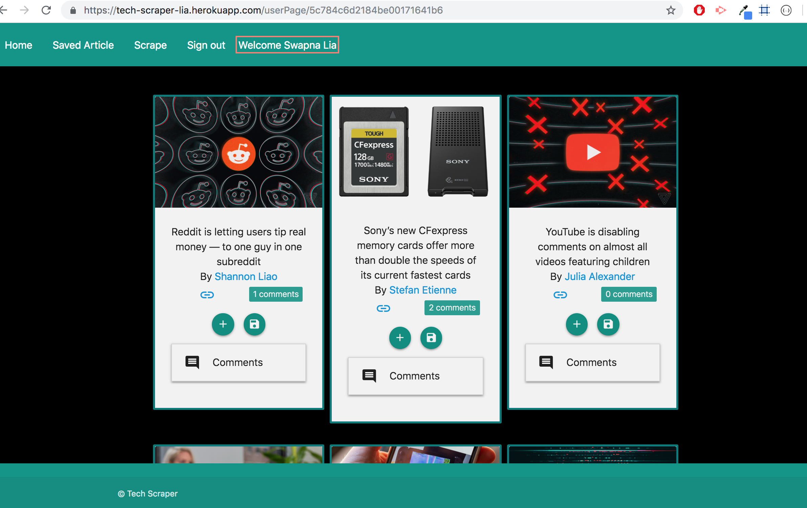
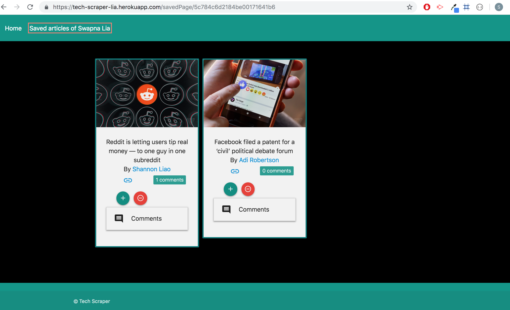
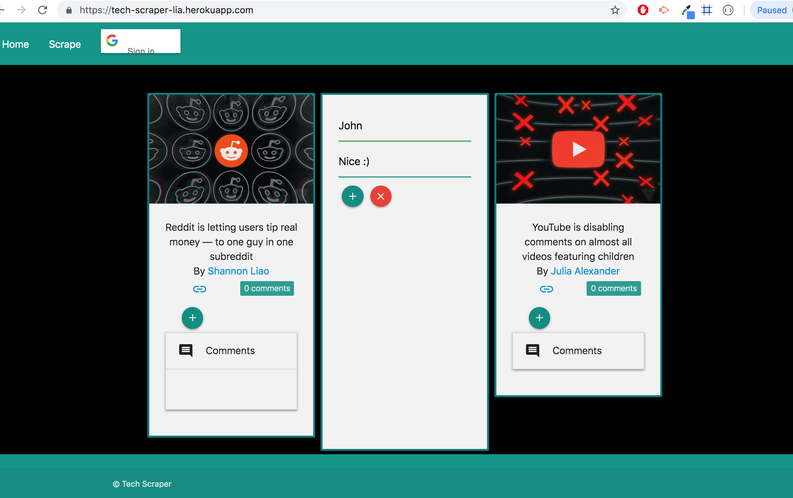
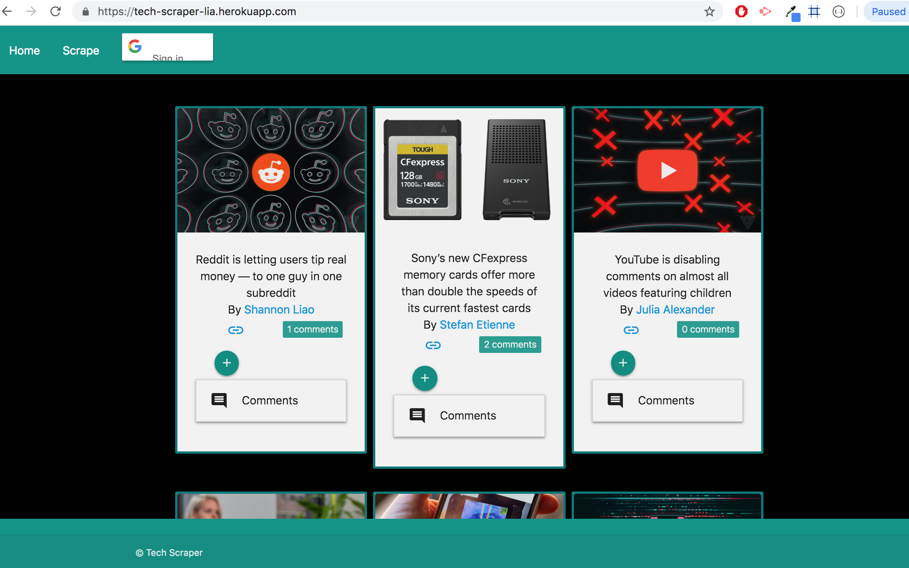
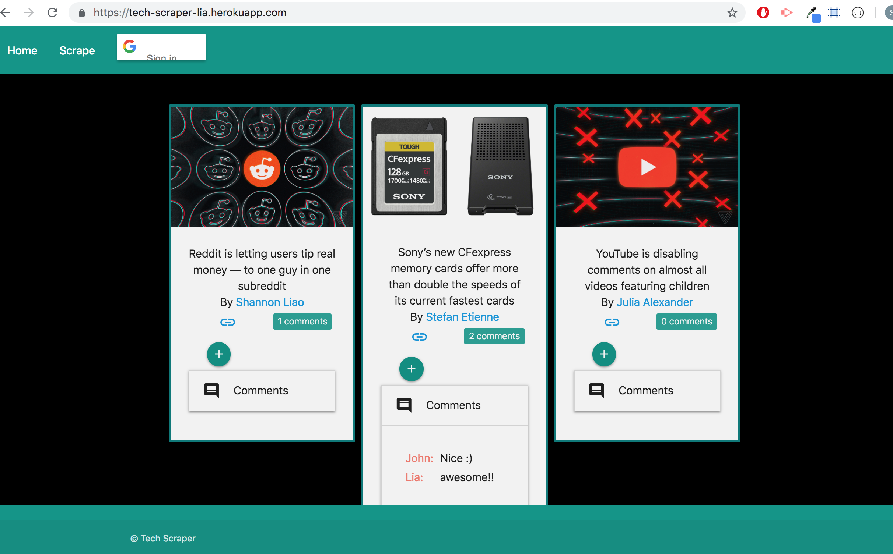
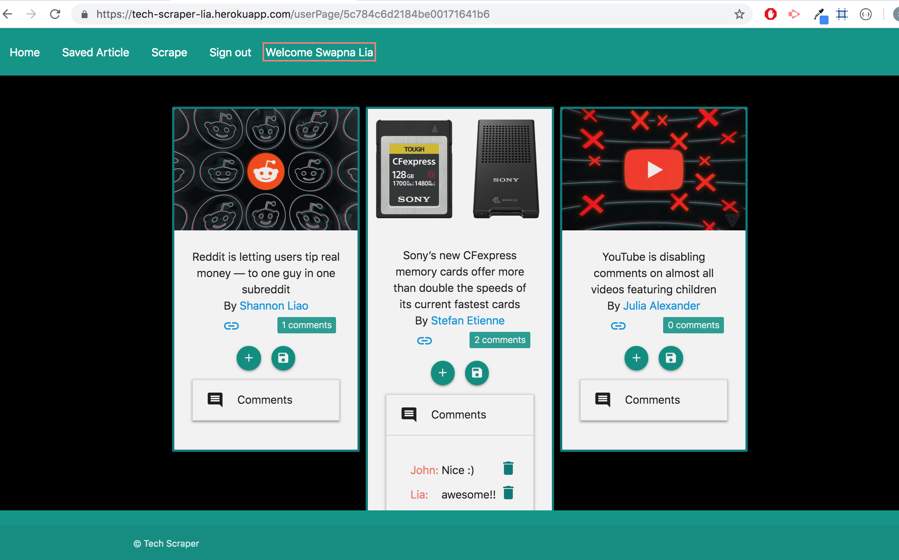
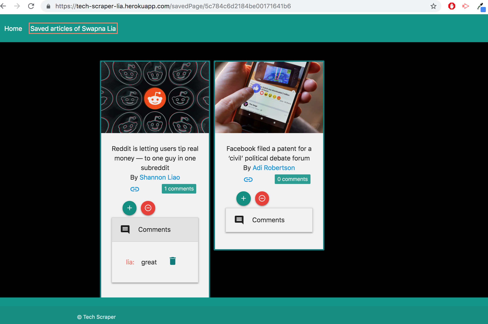

# TechScraper

### Overview
---
A web app that lets users view and leave comments on the latest Tech news articles. The news articles are scraped from another site using Mongoose and Cheerio.

### Getting Started
---
* Clone down repo ``` git clone git@github.com:liaswapna/TechScraper.git```.
* Navigate to the repo ```cd TechScraper```.
* Run command ```npm install``` in Terminal or GitBash
* Run command ```node server``` to start the server.

### Technologies Used
---
* HTML5
* CSS3
* Materialize
* Node.js
* Express
* Express-handlebars
* Mongoose
* Axios
* Cheerios
* Bluebird


### Dependencies
---
```js
{
    "axios": "^0.18.0",
    "bluebird": "^3.5.3",
    "cheerio": "^1.0.0-rc.2",
    "express": "^4.16.4",
    "express-handlebars": "^3.0.2",
    "mongoose": "^5.4.15",
    "mongoose-findorcreate": "^3.0.0"
}
```

### Demos :earth_asia:
---
TechScraper
* [Heroku Link](https://tech-scraper-lia.herokuapp.com/)

### Screenshot
---

*   Home page of the TradeScraper web app. This page is accessible to all the users including Guest users.
    *   The guest user can view the article feeds on the site.
    *   The user can add comments on it.
    *   The user can also use google sign in if they want to save an article.

    

*   User page after login of the TechScraper app.
    *   Logged-in user have access to all the previleges given for the guest users and  more
    *   Logged-in user can add comment to articles.
    *   Logged-in user can delete comments to the articles.
    *   Logged-in user can save the article
    *   logged-in user can signout.

    

*   Save page of the TechScraper web app.
    *   This page is only accessed by logged-in user.
    *   This page contains all the lists of saved articles.
    *   The user can add and delete comments.
    *   The user can delete saved article.

    

*   User can add notes on the articles.

    

*   User can view the comment counts on each article.

    

*   Guest User can view comments on each article.

    

*   Logged in user can view comments with delete option

    

*   Logged in user's save page can view the comments with delete option and also have option to delete saved article.

    


